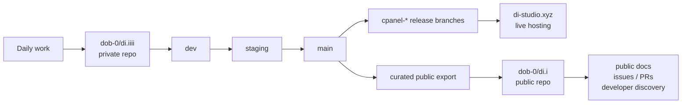

# di.i

**Web XR Node-Based Reality Creation Language**

*Web XR Spatial-Sync Creator Network*

`di.i` is an open-source, node-based Web XR reality creation system. It behaves like a visual programming language for linking digital logic, spatial media, and real environments through authored nodes, shared spaces, and live project documents. It is built on the web as a serious medium and universal substrate, not as a browser-only limitation.

## Project Links

- Live site: [di-studio.xyz](https://di-studio.xyz)
- Public repo and contributor front door: [dob-0/di.i](https://github.com/dob-0/di.i)
- Private working and deployment repo: [dob-0/di.iiii](https://github.com/dob-0/di.iiii)
- Public-context materials: [docs/deck](docs/deck/)
- Public/private workflow: [Private Dev And Public Showcase Workflow](docs/ops/PRIVATE_DEV_PUBLIC_SHOWCASE.md)
- Deployment runbook: [Live Deploy Runbook](docs/deploy/LIVE_DEPLOY.md)

## Repo And Hosting Topology



## Repositories

- `dob-0/di.iiii`
  - private working repo
  - active source of truth for development, staging, deployment automation, and hosting-connected release flow
  - branch model: `dev -> staging -> main`
  - hosting should deploy from this repo and its generated release branches
- `dob-0/di.i`
  - public repo
  - main public showcase and open-source place for people to collaborate and create
  - curated source, docs, public narrative, and contributor/discovery entrypoint
  - should receive reviewed exports from `di.iiii`, not raw `dev` history or private operational material
- relationship
  - private work happens in `di.iiii`
  - `di.i` is the visible public place where collaboration happens in the open
  - public code/docs are intentionally promoted into `di.i`
  - production hosting must not treat `di.i` as the deploy source of truth

## What di.i is

`di.i` is both a software platform and a studio-network direction.

- As software, it is a web-based authoring system built with React, Vite, Three.js, Web XR, and a Node backend in `serverXR`.
- As a model, it treats authored reality as a graph of nodes, surfaces, projects, assets, and runtime relationships.
- As a direction, it aims toward broader reality creation across virtual and physical environments, while staying grounded in the web as an everywhere layer.
- As a working repo, it currently contains the stable Studio lane, the experimental Beta lane, compatibility V1/editor history, and the backend/runtime contract that holds them together.

## Current Truth

This is the current shipped and working reality of the repo.

- Package/runtime baseline:
  - package version `0.2.0`
  - Node `22.x`
  - npm `10.x`
- Branch lanes:
  - `dev` = active development and integration
  - `staging` = stable preview and promotion lane
  - `main` = production lane
- Product lanes:
  - `Studio` is the stable main authoring lane
  - `Beta` is the experimental node-first lane
  - `V1` remains the fallback and compatibility lane
- Public route behavior:
  - `/<space>` shows the live published project for a space
  - if no project is published, it falls back to the blank node workspace for that space
- Backend role:
  - `serverXR` is authoritative for spaces, projects, assets, ops, SSE, presence, and edit enforcement
- Data model:
  - spaces are the public and management unit
  - projects are editable documents inside a space
  - a space may point at one `publishedProjectId` for its live public route
- Current limits:
  - persistence is still single-host filesystem storage
  - write protection uses session/token-based auth, not full user identity, roles, and audit trails yet

## North Star

This is the intended long-term direction that should guide new work.

- `di.i` should behave like a Web XR visual programming language for creating realities, not only scenes or layouts.
- Everything important should become node-native:
  - world behavior
  - view behavior
  - authored media
  - runtime tools
  - nested or recursive projects
- The canonical authored model should continue moving toward recursive node-first documents and node ops.
- The web should remain a universal substrate for authoring, sharing, and runtime connectivity even as the system grows beyond a single web app surface.
- Physical-world sync, hardware-linked environments, and broader multichannel reality creation are part of the real direction of the project, grounded in public/context work and experiments, but they are not yet fully productized repo capability.

## Still Transitional

This repo is intentionally between generations.

- `Studio` is the main product lane, but it is not fully node-native yet.
- `Beta` contains the first real recursive node editor surface, but it is not the only canonical product truth.
- `V1` still exists because compatibility and migration still matter.
- Legacy fields like `worldState` and `windowLayout` are still present as compatibility mirrors.
- Legacy entity/object behavior still coexists with newer node-first behavior.
- Filesystem persistence and the current auth model are good enough for the present host/setup, but they are not the long-term scale target.

## Core Model

- `space`
  - the public and management unit
  - owns routes such as `/<space>`, `/<space>/studio`, `/<space>/beta`, and `/admin?space=<space>`
- `project`
  - the editable authored document inside a space
  - stored and synced independently from the public route
- `publishedProjectId`
  - the project currently exposed on the public route for a space
- canonical project direction
  - `rootNodeId`
  - `nodes[]`
  - `edges[]`
  - `assets[]`
  - `templates[]`
  - `workspaceState`

Source-of-truth guidance:

- `src/project/` is the shared project logic center for document state, sync, presence, API behavior, and viewer/editor coordination.
- `src/shared/projectSchema.js` is the long-term schema center for the recursive node-first document model.
- `shared/` and `src/shared/` carry cross-runtime schema and contract logic.
- `worldState`, `windowLayout`, and older entity structures should be treated as compatibility bridges, not the long-term canonical center of the system.

## Surfaces And Lanes

| Surface | Route | Role | Status |
| --- | --- | --- | --- |
| Local Blank Workspace | `/` | clean local node-first starting point | Active |
| Public Space View | `/<space>` | live published project route for a space | Active |
| Studio | `/<space>/studio` | stable main authoring workspace | Canonical main lane |
| Beta | `/<space>/beta` | experimental node-first and research lane | Experimental |
| Admin/Ops | `/admin?space=<space>` | operator/debug/status surface | Active |
| V1 Legacy | compatibility/history code path | fallback and migration/editor history lane | Compatibility |
| `serverXR` | `/serverXR` | backend runtime for spaces, projects, assets, ops, presence | Required |

## Where Work Should Happen

- `src/studio/`
  - stable main authoring lane
  - default place for main-lane authoring UI work
- `src/beta/`
  - experimental and research lane
  - place for node-first/editor-v2 exploration
- `src/project/`
  - shared document, sync, presence, asset, and viewer/editor logic
  - the safest default place for cross-lane project behavior
- `src/shared/` and `shared/`
  - schema/runtime contract layer
- `serverXR/`
  - backend runtime, auth, assets, persistence, SSE, and presence
- older orchestration surfaces
  - `src/App.jsx`, `src/components/`, and `src/hooks/` still carry important active behavior
  - do not automatically treat them as the best long-term home for new canonical behavior

Default contribution rules:

- Prefer `Studio` for main user-facing product work unless the task is explicitly experimental.
- Prefer `src/project/` for shared document and collaboration behavior.
- Prefer node-first definitions and ops over growing legacy object/window systems.
- Treat V1-oriented edits as compatibility work unless the task is explicitly about legacy support or migration.

## Working Process

### Local setup

```bash
nvm use
npm install
npm --prefix serverXR install
```

### Normal start-of-session flow

```bash
git switch dev
git pull --ff-only origin dev
npm run dev
```

### Core local commands

```bash
npm run dev
npm run lint
npm run build
npm run test
npm run test:server-contracts
```

Useful local routes:

- `http://localhost:5173/`
- `http://localhost:5173/main`
- `http://localhost:5173/main/studio`
- `http://localhost:5173/main/beta`
- `http://localhost:5173/admin?space=main`
- `http://localhost:4000/serverXR/api/health`

### Branch and promotion rules

- normal work starts on `dev`
- normal promotion path is `dev -> staging -> main`
- do not start routine feature work on `main`
- use `main` directly only for emergency production hotfixes

### Release summary

From the repo root:

```bash
npm run deploy:staging
npm run deploy:production
```

Normal release rule:

1. work on `dev`
2. validate locally
3. promote to `staging`
4. verify staging
5. promote to `main`

Use the dedicated deploy docs for host-specific details, emergency recovery, and cPanel-specific operations.

## Status Dashboard

| Area | Current State |
| --- | --- |
| Main authoring lane | `Studio` |
| Experimental lane | `Beta` |
| Public route | `/<space>` shows the published project or blank node workspace |
| Backend authority | `serverXR` owns spaces, projects, assets, ops, presence, and edit enforcement |
| Canonical model direction | recursive node-first project documents |
| Shared logic center | `src/project/` |
| Schema center | `src/shared/projectSchema.js` |
| Compatibility bridges | `worldState`, `windowLayout`, legacy entities, V1 flows |
| Persistence | single-host filesystem-backed |
| Auth state | session/token-based, not full identity/role/audit model yet |
| Physical sync/hardware layer | real direction grounded in experiments/context, not fully productized repo capability |
| Verified checks | `npm run lint`, `npm run build`, `npm run test`, `npm run test:server-contracts` passed on `2026-04-17` |

Active transitions:

- `Studio` is moving toward deeper shared project logic and eventual fuller node-native behavior.
- `Beta` is the live experimental home of the recursive node editor.
- `V1` remains in place for migration, compatibility, and history-sensitive work.
- Public routes stay intentionally simple even as the authoring model grows more capable.

Unknowns that still matter:

- long-term identity/role/auth model
- storage beyond single-host filesystem persistence
- fuller Studio parity with the node-first model
- productized physical sync and hardware-linked runtime layers

## For Future Humans And AI

Start here before making assumptions about the repo.

- Treat `Current Truth` as shipped/working reality.
- Treat `North Star` as direction, not automatic present capability.
- Treat `Still Transitional` as a warning label around bridge code, compatibility behavior, and mixed-generation architecture.

How to identify source of truth:

- project model and shared editor behavior:
  - `src/project/`
- long-term project schema:
  - `src/shared/projectSchema.js`
- backend contract and persistence:
  - `serverXR/`
- deeper product/architecture intent:
  - `docs/architecture/`

What not to mistake for canonical:

- legacy mirrors are not the future data model
- V1 compatibility behavior is not the default product direction
- large old orchestration files are not always the right home for new permanent logic
- physical/hardware sync should not be described as fully productized unless the repo truth has caught up

Safe defaults for new work:

- put shared project behavior in `src/project/`
- prefer node-first behavior over new permanent legacy behavior
- use `Studio` as the default main product lane
- use `Beta` when the task is explicitly experimental, research-oriented, or node-first
- update docs when architectural truth, workflow truth, or lane truth changes

What to read next by task:

- product architecture:
  - [Recursive Node Core](docs/architecture/RECURSIVE_NODE_CORE.md)
  - [Project Surfaces](docs/architecture/PROJECT_SURFACES.md)
  - [Project Audit And Growth Plan](docs/architecture/PROJECT_AUDIT_2026-04-17.md)
- backend/runtime:
  - [serverXR README](serverXR/README.md)
- deploy/release:
  - [Live Deploy Runbook](docs/deploy/LIVE_DEPLOY.md)
  - [cPanel Prebuilt Deploy](docs/deploy/CPANEL_PREBUILT_DEPLOY.md)
- public context and studio framing:
  - [Public Deck Context](docs/deck/)

## Context And Supporting Docs

`di.i` is grounded in real XR, spatial, and artistic practice. This repo is the software core of that direction, but it sits inside a broader context of studio work, experiments, collaborations, and public-facing research around linking virtual and physical environments.

Public vision and repo model:

- `dob-0/di.iiii` is the private working and deployment source of truth
- `dob-0/di.i` is the public repo, public narrative surface, and contributor/discovery entrypoint
- hosting should deploy from the private repo release lanes and generated `cpanel-*` branches, not from the public showcase repo
- the public repo should point people to the live site and curated source, while the private repo keeps raw operations, staging details, and host-specific workflow
- intended topology:
  - `di.iiii:dev -> di.iiii:staging -> di.iiii:main -> hosting`
  - `di.iiii:main -> curated export -> di.i:main`
- this repo is the private working source of truth for active development, deployment, experiments, and unfinished integration work
- the public repo is the curated public/showcase surface for audited source, docs, portfolio context, and the broader `di.i` vision
- do not push raw `dev` work, local archives, `.env` files, generated backend env files, cPanel/private host paths, or private uploads directly to the public repo
- the public repo should receive intentionally selected material from this repo after it is reviewed, cleaned, and aligned with the `di.i` Web XR reality-creation story
- the live website may be public while the working process, staging details, and private operational material stay protected in this repo

Use the materials below as context and proof, not as replacements for repo truth:

- architecture and repo direction
  - [Project Audit And Growth Plan](docs/architecture/PROJECT_AUDIT_2026-04-17.md)
  - [Project Surfaces](docs/architecture/PROJECT_SURFACES.md)
  - [Recursive Node Core](docs/architecture/RECURSIVE_NODE_CORE.md)
- workflow and deployment
  - [Live Deploy Runbook](docs/deploy/LIVE_DEPLOY.md)
  - [Private Dev And Public Showcase Workflow](docs/ops/PRIVATE_DEV_PUBLIC_SHOWCASE.md)
  - [serverXR README](serverXR/README.md)
- checkpoints and current movement
  - [Checkpoint 2026-04-09](docs/checkpoints/2026-04-09.md)
- public/studio context
  - [Public Deck Context](docs/deck/)

The root README should stay evergreen. Dated milestones, external applications, or time-sensitive movement belong in supporting docs, checkpoints, or deck material rather than in this canonical entrypoint.
