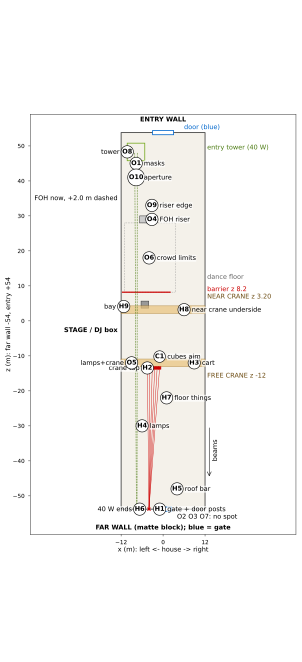

# MOXIR hall - site sheet (one page)

For the owner's visit to the hall at Charentsavan. Every row is one thing to measure, where, with what, the number that passes, and what a pass lets us do. A pass here only lets the lead accept the check on paper. It never means "safe", and no laser goes live from this sheet alone. Heights are metres above the floor; x is across the hall (house right is +), z is along it (the entry is +54, the far wall is -54).

| Point | Measure, and where | Tool | Passes if (source) | Unlocks |
|---|---|---|---|---|
| H1 | Far wall: where the gate's and the steel door's side posts (jambs) stand, and their tops; the wall strip x -5.5..-2.5, y 8.0..10.5, never seen. | Laser distance meter, tape, photo | Gate's left post at x >= -1.1 (left of it: stop). Beams stay 3.0 over / 2.5 beside any opening. (M:173; J:307-311) | H1 closes; the six cubes keep their end. Else the lead picks the right-hand fallback end or a new aim. |
| H2 | Top of the free crane's far main beam (girder), x -5..-0.5: its real height, and what sits on it (rail, clips, cable track). One strap point per cube. | Laser meter from the walkway, tape | Top 8.46..9.01 (J:238). Nothing taller than 0.28 in front of a cube. (J:312-316) | H2 closes; cubes may sit on the crane top. |
| H3 | Free crane at z -12: drive its cart (trolley) to the +x end and lock it; hook wound up; lock-out. | Tape, the crane operator | Cart locked at x 7.6..10.2 (J:317-321). If it will not move, cubes 03, 05, 06 clash. | H3 closes; the park at z -12 is confirmed. |
| H4 | Lamps hanging over the far half (strip x -6..0, z -13..-54): lowest point at z -18, -30, -48. | Laser meter pointed up, tape | Lowest >= 9.43 at z -18, 9.76 at z -30, 10.24 at z -48 (J:322-326). For the 40 W also >= 8.42 (M:319). | H4 closes. |
| H5 | Roof's bottom bar (bottom chord of the roof frame) at z -48. | Laser meter pointed straight up | >= 10.6 (M:173). The model says 10.6..11.2, least gap 0.448 (M:156). | H5 closes. |
| H6 | The two 40 W beams' final spots on the far wall (the door fix raises them 0.40). | Tape, laser meter, paper rig file | Stay inside x -8.29..-5.12, y 5.17..8.17 (M:308). A move means a re-run. (J:332-336) | H6 closes. |
| H7 | Far floor under the beams' strip x -7.1..1.5: the highest tank, gas cylinder or stair. | Tape, laser meter | Nothing above 3.71 at z -31..-13, or 3.59 at z -54..-31 (J:337-341). Else fence or move it. | H7 closes. |
| H8 | Near crane's main-beam underside at z 3.20 (beam edge z 1.75..2.10): the real height. Three readings. | Laser meter from the floor | >= 7.65 closes it (M:173). At 7.2 only the lead may take the route "FOH 2.0 to the right, fan 0.4 deg": +0.023 (M:181). | The two 40 W may go live only after the lead accepts AND O1..O8 close. |
| H9 | Bay beside stage-left column, x -12..-10.5, z 1.75..6.5: a hard barrier (not tape), crew only. | Tape | Barrier stands: public gap 0.622 with it, 0.33 without, and 0.33 fails (M:175). | H9 closes; the show with the hanging truss (the cut) flown may run. |
| C1 | Each cube's aim and its beam block (the plate that stops stray light): tilt +0.53 deg above level; block everything below -0.53. | Inclinometer app, spirit level on the block edge | Tilt 0.527; pan per cube from the sheet (0.666, -0.328, -1.322, -2.315 ...). (J:353-410) | With H1..H7 and H9 closed and O7 signed, the six beams may go live after the lead accepts. |
| O1 | Aperture masks on both 40 W outputs: hole size and place. | Calipers, tape, inclinometer app | Passes only aim +-0.3 deg; non-combustible; rated for 41 W. (M:315) | Needed before any 40 W light at all. |
| O2 | Bench test of one 40 W unit: pull the control cable (DMX); check its key switch with E-stop 1. | The unit, the desk, a stopwatch | Goes dark or stays in the mask. NOT VALID: no time or angle number is written. (M:316) | Needed before any 40 W light. |
| O3 | Poligraf's data: output opening (aperture), how divergence is defined, scan angle. | Datasheet, an e-mail | Opening <= 10 mm and divergence <= 1.3 mrad (milliradians) are the numbers assumed (M:181). | Replaces assumed numbers; the NOHD (safe distance) 1 097 m is redone. |
| O4 | The tapes that bind: near crane underside (H8) and the FOH desk riser: height and place. | Laser meter, tape | Riser 0.6 high at x -6.7..-3.7, z 28..30 (stage json:120). Underside 7.2 used; a taped 7.6 gives only +0.207 (M:318). | Fixes the 40 W margin; chooses the H8 route. |
| O5 | Free crane seen at z -12 with cubes on top; pendant lamps over the strip. | Eyes, laser meter | Nothing lower than 8.42 over the strip (M:319). | Pairs with H3 and H4. |
| O6 | Crowd plan: what people could stand on under the beams (tables, crates, cases). | Tape | Max 0.80 at the entry end, 0.64 on the dance floor, 0.34 behind the stage, 0.17 at the far end. (M:320) | Needed for the 40 W strip. |
| O7 | Sign-off: the licensed laser safety officer's walk at low alignment power; the permit's issuer and number. | His paper | Signed, number written. NOT VALID: no number exists yet. (M:321) | The only thing that lets any laser emit; the desk holds 0 until then. |
| O8 | 40 W tower at z 48: load table, ballast, stability check (ANSI E1.21), rigger's sign-off, fenced pen in the crowd plan. | Rigger's paper, tape | Pen x -10.25..-5.24, z 45.77..50.78 (M:307). Aim held to 0.4 deg if the route is taken (M:181). | Tower may stand; the 40 W may be aimed. |

Source keys: M = docs/moxir/MOXIR.md; J = scripts/place/rigs/moxir-lasers-on-crane-2026-10-09.json; stage json = scripts/place/rigs/moxir-stage-v2-cranes-2026-10-09.json. Lines on branch feat/moxir-cranes-lasers-2026-10-09. Rules: IEC TR 60825-3 (3.0 over / 2.5 beside), IEC 60825-1 (safe distance). Plan: `python3 -B scripts/place/moxir_site_sheet.py`. Words: hall, place, floor; "the cut" = the hanging truss. Status: DRAFT, unvalidated until measured on site.
