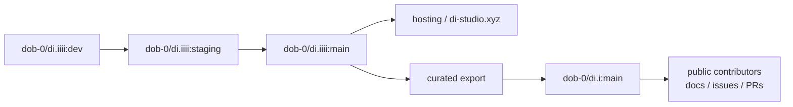

# Private Dev And Public Showcase Workflow

This is the operating model for keeping the live project public while protecting unfinished work, hosting details, local archives, and the raw development process.

## Key Links

- Live site: [di-studio.xyz](https://di-studio.xyz)
- Public repo: [dob-0/di.i](https://github.com/dob-0/di.i)
- Private working repo: [dob-0/di.iiii](https://github.com/dob-0/di.iiii)
- Deploy runbook: [Live Deploy Runbook](../deploy/LIVE_DEPLOY.md)
- cPanel prebuilt deploy: [cPanel Prebuilt Deploy](../deploy/CPANEL_PREBUILT_DEPLOY.md)

## Visual Flow



## Goals

- Keep the live website public.
- Keep an open-source/showcase path public when code is ready.
- Keep messy work private until it has been audited and intentionally promoted.
- Never publish local scene archives, raw cPanel secrets, `.env` files, generated backend env files, or private upload data.

## Repositories

Use two lanes:

- **Private working repo**
  - current role: `dob-0/di.iiii`
  - active daily work
  - branches: `dev`, `staging`, `main`
  - owns deployment automation, release staging, and host-specific operational material
  - may contain unfinished features and private deployment scripts
- **Public showcase/open-source repo or mirror**
  - current role: `dob-0/di.i`
  - curated source and docs only
  - should be the public discovery point for other developers
  - may link to the live site and accept public issues/PRs
  - no raw work branches
  - no local test archives
  - no deploy secrets or environment-specific private paths

The current working repo should remain private until history and docs have been audited.

## Branch Rules

Private working repo:

- `dev`: messy active work
- `staging`: integration and release-candidate work
- `main`: private stable source of truth

Public showcase:

- `main`: curated public code/docs
- optional `showcase`: public demo branch if it is useful for the website or documentation

Promotion path:

```text
private dev -> private staging -> private main -> curated public showcase
```

Do not push private `dev` directly to a public branch.

Concrete intended flow:

```text
dob-0/di.iiii:dev -> dob-0/di.iiii:staging -> dob-0/di.iiii:main -> hosting
dob-0/di.iiii:main -> curated export -> dob-0/di.i:main
```

## Deployment Rules

- The live website may stay public.
- Deploy from private `staging`/`main` or from a generated release artifact.
- Keep hosting connected to `dob-0/di.iiii`, not to `dob-0/di.i`.
- Treat `dob-0/di.i` as the public-facing code/docs lane, not the raw cPanel source of truth.
- Store credentials in GitHub or cPanel secrets only.
- Do not commit generated `.env` files.
- Do not publish cPanel account-specific filesystem paths unless they are intentionally documented as examples.

## Public Release Checklist

Before mirroring code into a public repo or public branch:

- Run tests, lint, and build.
- Run a secret scan on the public-bound tree/history.
- Confirm `scene examples/`, `.env`, `.deploy/`, `serverXR/data/`, `serverXR/uploads/`, and local archives are absent.
- Confirm README and architecture docs do not expose private hosting details.
- Confirm only intended branches exist on the public remote.
- Confirm the live website still loads after deployment.

## Local Ignore Policy

The following must stay local unless intentionally sanitized:

- `scene examples/`
- `*.dii-project.zip`
- `*.scene.zip`
- `.env`
- `.env.*.local`
- `.deploy/`
- server upload/data directories

## Emergency Containment

If private work was pushed to a public repo:

1. Make the repo private immediately.
2. Rotate any exposed credentials.
3. Audit the full pushed history.
4. Create a clean public mirror from audited content only.
5. Delete public raw-work branches after the private workspace is confirmed.
